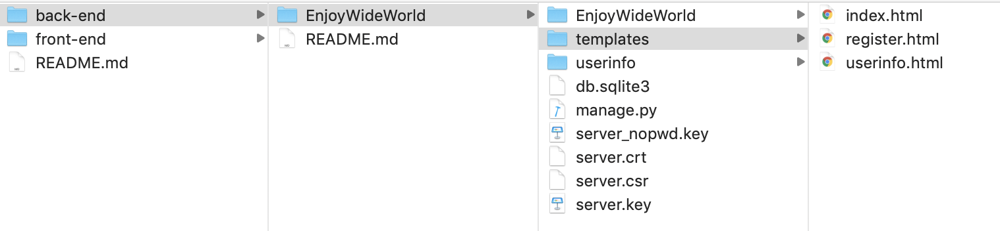
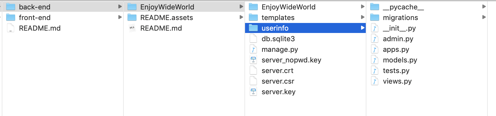

# 后端

## 云端运行

https://wangtong15.com:20000/admin/

https://wangtong15.com:20000/index/

Admin：

```shell
username : root
password : enjoywideworld
```

## 本地运行

进入manage.py所在的目录下

```python
python manage.py runserver 127.0.0.1:20000
```

## 静态网页列表



## 用户App



- 主要修改views即可

